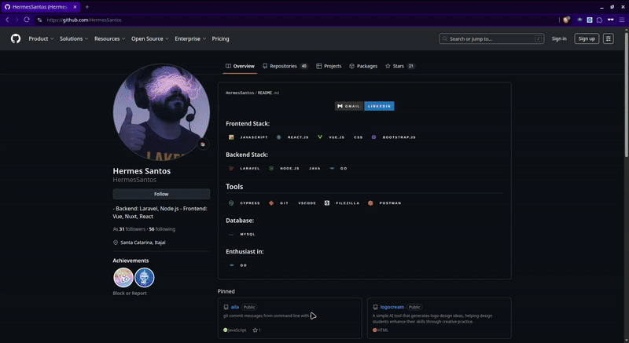

# Aether

Aether is a browser extension that adds a floating input to the center of the screen, allowing for quick and easy interaction.

## Features

- Floating input that appears in the center of the screen
- Activated through the `Ctrl+M` shortcut or by clicking the extension icon
- Clean and minimalist interface
- Compatible with all websites

## Installation

1. Clone this repository or download the files
2. Open your browser and go to the extensions page:
   - Chrome: `chrome://extensions/`
   - Firefox: `about:addons`
3. Enable "Developer mode"
4. Click "Load unpacked"
5. Select the project folder

## Usage

- Press `Ctrl+M` on any page to open the input
- Or click the extension icon in the toolbar
- The input will appear in the center of the screen
- Type your text and press Enter to submit

## Project Files

- `manifest.json` - Extension configuration
- `content.js` - Main script that implements the floating input
- `background.js` - Background script for event management
- `icon.png` - Extension icon

## Requirements

- Browser compatible with Manifest V3 (Chrome, Edge, Firefox)

## Version

Current version: 1.1

## License

This project is under the MIT license.
